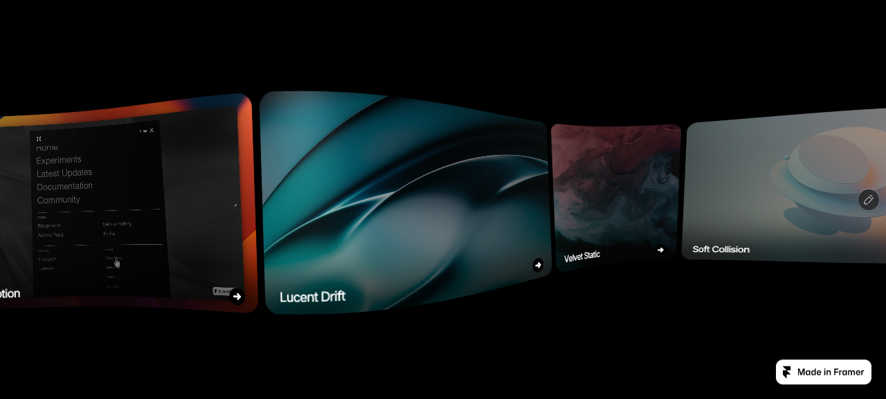
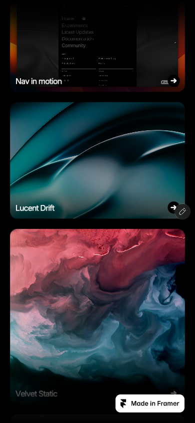

# Warped gallery, source-faithful React component

## Goal

Port https://bold-lychee-277407.framer.app/ into a pure React/TSX implementation for the BLANK registry.
No imported HTML, iframe, embedded page, injected source markup, remote JavaScript or Framer wrapper. The shipped implementation consists of typed React code and local TypeScript renderer/shader modules.
Preserve the gallery's actual raw-WebGL rendering, media, typography and interaction. Remove the Framer runtime and page badge.
Verify extracted mechanics against pinned source and compare rendered desktop/mobile states at matched sizes.

## Source and intended result

[Live source, including interaction](https://bold-lychee-277407.framer.app/)

Desktop source at 1280 × 580:



Mobile source at 390 × 844:



The canvas renders subdivided textured cards. Wheel or drag input changes a smoothed scroll offset and its lag bends the cards. Desktop runs horizontally; mobile runs vertically. Hover/focus indents each card and animates its arrow. Titles render into textures so they bend with the card. Transparent DOM anchors provide actual links and keyboard focus.

The published shared module contains the implementation. Pinned files are `reference/bold-lychee/index.html`, `gallery.mjs`, `shared-lib.mjs`, and `script_main.mjs`. The inspected source changed the implementation choice: use its raw WebGL shaders, not CSS transforms or a new graphics dependency.

## Public API

One client component, `WarpedGallery`, with typed project data. The container composes with ordinary page sections, headers and overlays. It controls its own canvas; cards cannot be arbitrary React children because their contents deform inside the shader.

```tsx
import { WarpedGallery, type WarpedGalleryProject } from "./warped-gallery";

const projects = [
  {
    title: "Lucent Drift",
    image: "/work/lucent-drift.jpg",
    href: "/work/lucent-drift",
    aspectRatio: 1.5,
  },
] satisfies readonly WarpedGalleryProject[];

export function WorkSection() {
  return (
    <section>
      <WarpedGallery
        projects={projects}
        showGrid={false}
        aria-label="Selected work"
        style={{ height: "min(80vh, 720px)" }}
      />
    </section>
  );
}
```

Project fields: `title`, `image`, optional `video`, `href`, `aspectRatio`. Video projects can supply an image poster. No Framer-specific image objects or upload controls in the public API.

Gallery props: `projects`, `className`, `style`, accessible label, `background`, `titleColor`, `showGrid`, `playVideos`, `openInNewTab`, `mobileBreakpoint`, `scrollSensitivity`. Require an explicitly sized container. Keep source defaults for tuning; the demo uses `showGrid={false}`, as the linked page does.

The component will not import demo assets by default. Export sample projects separately so consumers can use their own data without loading unrelated media.

## File responsibilities

| Files | Responsibility |
| --- | --- |
| `src/registry/warped-gallery/index.tsx` | Public React component, types, accessible links, lifecycle and scoped styles |
| `src/registry/warped-gallery/renderer.ts` | Typed raw-WebGL controller, input/motion, media, resize and cleanup |
| `src/registry/warped-gallery/shaders.ts` | Source shader strings, with exact constants preserved |
| `src/components/demos/warped-gallery.tsx` | Source-equivalent eight-project demo using hosted assets |
| `src/components/previews/warped-gallery.tsx` | Fullscreen comparison surface |
| `src/lib/registry.ts`, `component-meta.ts`, `registry-groups.ts` | Installable files, API documentation and registry placement |
| Demo/preview indexes | Route wiring through the incumbent registry system |
| `src/lib/assets.ts` | Asset registration after upload to Vercel Blob |
| `reference/bold-lychee/` | Pinned text source and extracted source constants |
| `tests/warped-gallery.test.mjs`, `package.json` | Focused source-fidelity and lifecycle checks |
| `.plannotator/bold-lychee/` | Screenshots, comparison setup and verification evidence, not shipped component code |

## Implementation decisions

- Rewrite the implementation as readable typed React/TSX and local TypeScript. Render the container, canvas and links through JSX. Do not import or inject HTML, use `dangerouslySetInnerHTML`, embed the source page, or load its compiled JavaScript. No iframe, remote Framer module dependency, Three.js, or Motion requirement.
- Pinned HTML/JavaScript in `reference/` is test evidence only. No shipped component imports those files. GLSL is stored as local shader strings because raw WebGL requires shader source; this does not embed HTML.
- Preserve the 24 × 24 mesh, shaders, camera, 649px breakpoint, responsive layout, wrapping, scroll easing, hover timing, drag thresholds and video visibility behavior.
- Preserve the page's eight projects and asset ratios. Upload demo images, video and font to Blob before registering their URLs. No binary assets committed to git.
- Scope font/style setup to this component and keep independent renderer state per instance.
- Preserve accessible DOM anchors, focus-driven hover and keyboard browsing. Check cleanup on unmount and recreation when projects change.
- Respect reduced motion and provide usable static media links if WebGL is unavailable. These are explicit departures in those conditions; ordinary rendering retains source motion.
- Remove Framer's editor overlay and promotional badge. Keep horizontal right arrows, never a northeast arrow.

## Verification and acceptance

1. Compare source and implementation at 1280 × 580 and 390 × 844, with the same font, media readiness, DPR and resting offset. Freeze the video at the same frame for pixel comparison; mask only documented removed Framer chrome. Static-frame comparison must use identical media, not substitute artwork.
2. Record comparison conditions and initial tolerance before diffing. Do not increase tolerance to excuse divergence. Keep pixel diff images and numerical results. Motion/video capture differences must be identified, not claimed as fidelity.
3. Exercise wheel, mouse drag, mobile touch, focus/blur, link activation, keyboard scroll, resize, two independent instances, changed project data, reduced motion and WebGL fallback.
4. Test source shader/constants parity and run focused tests, typechecking, formatting and build checks. Check runtime console, clipping and asset loading.
5. Review the final implementation and evidence through Plannotator.

## Limitations and deliberate omissions

Current review material is the real source at desktop/mobile sizes, not an implemented port. Source inspection establishes that the renderer is standalone raw WebGL; it does not yet prove that the typed port renders correctly.

No redesign, extra gallery controls, studio, custom React card content, new animation library or unrelated registry cleanup. Preserve the source and report any unavailable asset upload, source-comparison or runtime verification capability as a blocker or unverified property.
