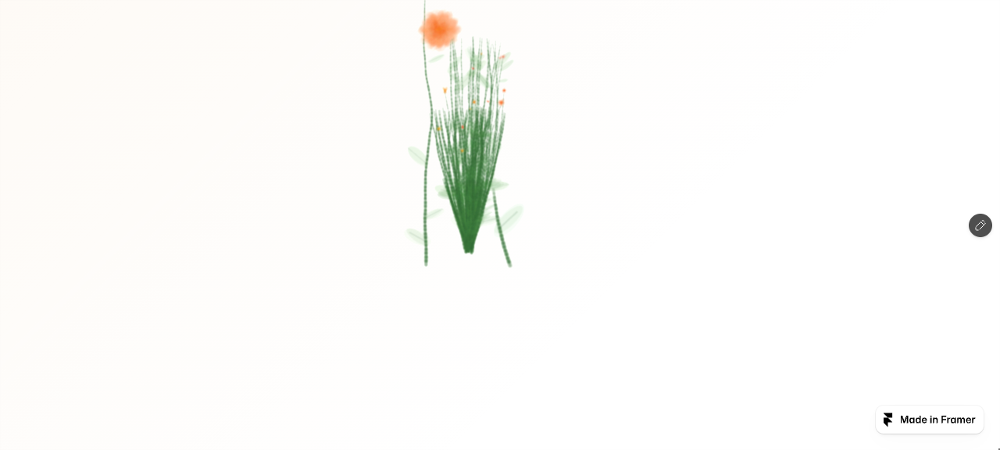
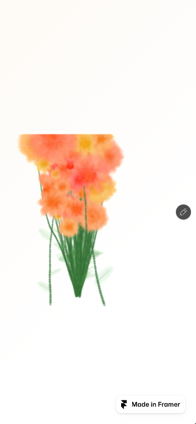
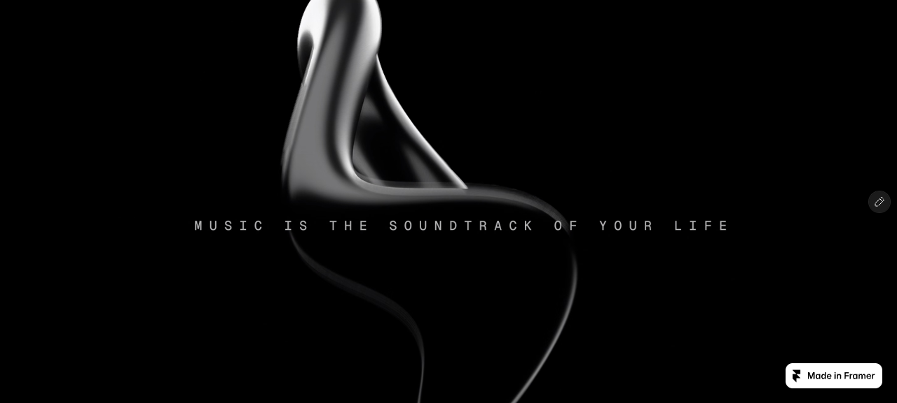
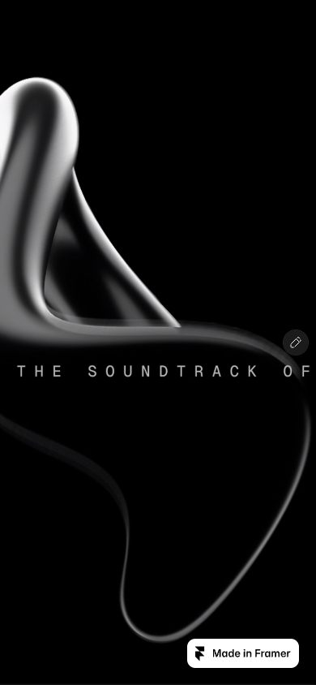

# Three Framer sources, three pure React components

## Scope

Add two components to the already approved [Warped gallery plan](../bold-lychee/plan.md).

All three are native React/TSX implementations with typed props and local TypeScript rendering code. No imported HTML, iframe, injected markup, remote compiled JavaScript, Framer runtime, or embedded page. Pinned source HTML and bundles are verification evidence only and will never be imported by shipped components.

| Source | Component | Actual mechanism |
| --- | --- | --- |
| [bold-lychee](https://bold-lychee-277407.framer.app/) | `WarpedGallery` | Wheel/drag browsing of shader-bent project cards, with titles rendered in card textures |
| [practical-assumptions](https://practical-assumptions-334944.framer.app/) | `HoverBloom` | Pointer movement grows stems and watercolor flowers into a persistent Canvas 2D layer |
| [real-result](https://real-result-504144.framer.app/) | `FluidRefraction` | GPU fluid simulation distorts a supplied image or video; the ribbon and slogan belong to the source image |

Preserve each source's visual treatment and mechanics. Remove Framer editor/promotional chrome. No redesign or extra UI.

## Source evidence

These screenshots are Current source, not implemented-port evidence.

### Hover bloom





The source starts blank. Move or press to grow flowers. Resize retains painted pixels, centering them horizontally and anchoring them at the bottom. The mobile screenshot retains desktop artwork, rather than representing a fresh page load.

Actual page settings use a warm palette, cream paper tint, white background, transparent dot grid and persistent flowers after pointer leave. There are no image/font assets for this component.

### Fluid refraction





The image uses cover cropping. The mobile crop cuts the slogan just as the source does; do not replace the image with editable text or change the crop.

Actual page settings: refraction 100, chromatic aberration 100, highlight 200, disappear speed 5.9, velocity dissipation 99, pressure dissipation 0, 50 pressure iterations, curl 18 and splat radius 3. Hover interaction is on.

The inspected implementation changed the technical choice: port its raw-WebGL fluid solver, not a Three.js ribbon or CSS filter approximation.

## Additional public APIs

```tsx
import { HoverBloom } from "./hover-bloom";
import { FluidRefraction } from "./fluid-refraction";

export function Hero() {
  return (
    <section style={{ position: "relative", height: "100vh" }}>
      <FluidRefraction
        image="/hero.png"
        refractionAmount={100}
        chromaticAberration={100}
        highlight={200}
        style={{ height: "100%" }}
      />
    </section>
  );
}

export function DrawingArea() {
  return (
    <HoverBloom
      palette="warm"
      paperTint="#FDF6EE"
      gridColor="transparent"
      style={{ height: 600 }}
    />
  );
}
```

`HoverBloom` exposes source-supported spawn/growth modes, rate, maximum active blooms, reset-on-leave, background/paper/grid settings, preset/custom palettes, stem/flower colors, bloom scale, blur, watercolor and trail fade. Standard container class/style and accessible label. Framer-only editor controls do not enter the public API.

`FluidRefraction` exposes image/video media as typed props, refraction/chroma/highlight, fluid tuning and hover-vs-press behavior, plus container class/style. Require caller media rather than silently loading demo imagery. Keep source knob units so demo settings map directly. Prefer a discriminated media union so image and video inputs cannot conflict.

Each component owns independent rendering state. Consumers compose sections and overlays around the component through ordinary React layout. Do not invent arbitrary React content inside textures. Sample media/data lives outside renderer code.

## Additional files

| Files | Responsibility |
| --- | --- |
| `src/registry/hover-bloom.tsx` | Native JSX, typed props and the procedural watercolor renderer |
| `src/registry/fluid-refraction/index.tsx` | Native JSX, typed media/settings and lifecycle |
| `src/registry/fluid-refraction/renderer.ts` | Fluid buffers, splats, simulation, image/video textures and cleanup |
| `src/registry/fluid-refraction/shaders.ts` | Exact source GLSL strings |
| `src/components/demos/{hover-bloom,fluid-refraction}.tsx` | Source-equivalent usage, with actual page settings |
| `src/components/previews/{hover-bloom,fluid-refraction}.tsx` | Fullscreen verification surfaces |
| Registry, metadata, asset and demo/preview indexes | Incumbent registration and public API documentation |
| `reference/{practical-assumptions,real-result}/` | Pinned original source and extracted mechanics |
| `tests/{hover-bloom,fluid-refraction}.test.mjs` | Focused mechanics, deterministic rendering setup and lifecycle checks |

WarpedGallery responsibilities remain those in its approved plan. All binary demo assets go to Vercel Blob first and enter `src/lib/assets.ts`; no binaries committed to git.

## Verification

- Same 1280 × 577 desktop and 390 × 844 mobile viewport for the two new sources. WarpedGallery retains its established comparison viewport.
- Record capture conditions and tolerance before comparison. Fix random seeds and animation-frame counts for bloom/fluid; identical pointer traces and reset state. Random artwork cannot be compared from unrelated runs.
- Pin shader strings and extracted source constants. Test exact values against original source.
- Pixel diff screenshots with only documented removed Framer chrome masked. No claims of fidelity if deterministic source capture cannot be established.
- Operate ordinary pointer/touch flows, resize, independent instances, prop/media changes, visibility pause and unmount cleanup. Test fallback/reduced motion separately.
- Run focused tests, typechecking, formatting, build and final implementation review. Inspect console, asset load failures and actual output after fixes.

## Allowed departures and limitations

Reduced motion and usable no-WebGL fallback for fluid/gallery are explicit accessibility additions. Fix touch coordinate handling inside embedded containers and dispose fluid resources on resize rather than reproducing leaks. Those fixes must not change normal fullscreen appearance or motion.

This plan's screenshots and observed interactions are from the real sources. The ports are not implemented or verified yet. Preserve the source's randomized drawing, not a substitute flower style. Preserve the supplied image for fluid, including its mobile crop. Report any asset-access/upload, deterministic comparison or runtime-verification blocker explicitly.
