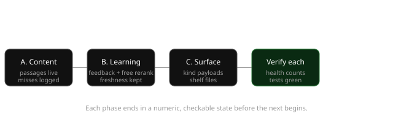
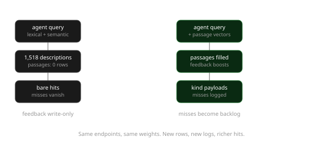

# Inspiration program: make the registry usable by agents

## 1. Goal in three lines

The registry holds 1,518 curated resources but agents reach past it: retrieval is rare, concentrated, and silent on misses, and the passages table that ranking already queries sits at zero rows in production. This program fills the content layer, logs what fails, learns from what agents adopt plus a free-model rerank where it measurably helps, keeps links fresh, and packages answers in sizes agents can actually use. Proof is numeric at every phase: passage counts, miss-log output, ranking tests, freshness reports, payload sizes.

## 2. Visual explanation

Overview of the program. Three phases, each ending in a verifiable state.



Current request path vs proposed path for a single agent query.



Today an agent query fans out to lexical, trigram, passage, and semantic passes over catalog text only, because `inspiration_passages` is empty in production and `inspiration_feedback` is write-only. After this program the same query also hits populated passage vectors, feedback-boosted ranks with an optional free-model rerank, and miss logging, and the response carries kind-shaped evidence instead of bare descriptions.

## 3. File table

| File | Responsibility today | After the change |
|---|---|---|
| `src/lib/inspiration/ingest.ts` | `drainJobs` refuses non-local DB; snapshots to local disk | CLI-invoked drain works against Neon with politeness discipline; disk snapshots stay local (the script runs on the laptop via `vercel env run`) |
| `scripts/inspiration.mjs` | `ingest`, `jobs`, `enqueue` wired; no backlog, miss, or freshness commands | Adds `backfill`, `misses`, `freshness`; keeps existing commands unchanged |
| `src/lib/inspiration/schema.ts` | Tables for resources, passages, jobs, snapshots, feedback, usage | Adds `inspiration_misses` table; adds quarantine columns on resources (reason must survive import, so columns, not document fields) |
| `src/lib/inspiration/retrieve.ts` | RRF over lexical/trigram/passage/semantic; preferences boost; evidence owner-only | Adds feedback boost, gateway rerank/expansion hooks, miss logging, `license` filter; scoring weights otherwise untouched |
| `src/lib/inspiration/store.ts` | `refreshEmbeddings` covers passages; `passagesFor` top-2 per resource | Adds `feedbackScores` aggregation and `logMiss`; `refreshEmbeddings` unchanged (already passage-aware) |
| `src/lib/inspiration/http.ts` | Feedback POST writes rows; search/inspect serve | No auth changes; miss context flows through `retrieve()` so CLI, MCP, and web log identically |
| `src/lib/inspiration/catalog.ts` | Seeds resources with explicit facets | Derives a `license` facet at seed time from description text; no catalog file edits across 1,518 entries |
| `src/lib/inspiration/types.ts` | `Resource` has kind/stack/useFor, no license | `Resource` and `RetrievalRequest` gain `license` |
| `src/lib/inspiration/validation.ts` | Accepts query/mode/limit/context/category/kind/stack | Accepts `license` the same way |
| `src/lib/inspiration/compat.ts` | Builds retrieve input field-by-field; renders markdown hits with evidence | Passes `license` through; renders per-kind payloads; `format=json` already exists and stays |
| New `src/lib/inspiration/rerank.ts` | Does not exist | Gateway rerank + expansion behind the injectable-dependency pattern `retrieve()` already uses for `semantic` |
| `src/app/inspiration/llms.txt/route.ts` | Small index + 51 categories | Lists the new section files alongside categories |
| New per-section routes (components, pages, backend) | Do not exist | Mid-size entirety files between the 4KB index and the 500KB dump |
| `mcp/blank-direction/server.mjs` | Returns markdown text for all tools | Adds optional `format: "json"` arg that requests the existing JSON routes; markdown stays default |
| `.agents/skills/blank-direction/SKILL.md` + dotfiles `direction-first` rule | Document `q`/`section`/`limit`, shelf scan, citations | Gain one line each for the `license` filter and the JSON format; no restructuring |
| `tests/inspiration-retrieval-quality.test.mjs` | Fixed quality cases | Gains miss-log-derived regression cases (needs phase A data) plus a rerank A/B case with stubbed gateway |
| `tests/direction-regression.test.mjs` | Direction protocol cases | Gains freshness-contract cases (dead link quarantined with reason, recheck clears it) |
| Docs (registry install pages) | shadcn-centric install | One-line install per harness (skills CLI, shadcn, manual copy) |

## 4. Real code for real choices

Phase A, choice 1. The production block in `drainJobs` is the single line that keeps passages at zero. The script already runs locally against Neon for import, so the fix scopes the guard to server routes instead of deleting it:

```diff
-/** Local pilot only. Cloud snapshots and scheduled ingestion require connected services. */
+/** CLI-invoked drain may target Neon. Server routes must never call this:
+    one invocation fetches up to `limit` sources with no request-scoped budget. */
 export async function drainJobs(db: InspirationDatabase, limit = 6) {
-  if (db.kind !== "local") throw new Error("Source ingestion currently requires the local database.");
+  if (allowUntrustedCaller()) throw new Error("Source ingestion requires an explicit CLI invocation.");
```

with `allowUntrustedCaller()` reading an explicit env flag the CLI sets. The SSRF guard (pinned addresses, 2MB cap, 12s timeout, 4 redirects) stays exactly as is. Backfill is polite by construction: sequential fetches, 1.5s delay between sources, resumable through the jobs table, and a `--dry-run` that reports extractable yield by category before any bulk run. Failed fetches keep today's behavior: visible errors, 3 attempts, then `failed`, never erasing the last good version.

Phase A, choice 2. A miss is zero *verified* hits, not zero hits. Recommend deliberately answers vague questions with `related` hits, so an empty-hits test would never log the exact queries most worth curating:

```diff
   } else if (mode === "recommend") {
     const verified = candidates.filter((hit) => hit.match !== "related");
     result.hits = (verified.length ? verified : candidates).slice(0, request.limit);
   } else result.hits = candidates.slice(0, request.limit);
+  if (!verifiedCount(result)) await logMiss(db, { query: request.query, mode, kind: request.kind, stack: request.stack });
   return result;
```

`logMiss` upserts a per-day bucket keyed by normalized query plus mode, so one agent's retry loop cannot flood the table. `inspiration misses` prints the top buckets, and each bucket is a future `/inspo` task. Logging lives in `retrieve()`, so CLI, MCP, and web log identically.

Phase A, choice 3. License needs no catalog edits because descriptions already state it ("MIT licensed", "Apache-2.0"). `catalog.ts` derives the facet once at seed time, defaulting to `unknown` rather than null, and it flows through the existing filter shape:

```diff
     if (request.stack && !resource.stack.some((s) => normalized(s) === normalized(request.stack ?? ""))) continue;
+    if (request.license && normalized(resource.license ?? "unknown") !== normalized(request.license)) continue;
```

`types.ts`, `validation.ts`, and `compat.ts` (which builds the retrieve input field-by-field) each gain the field the same way `stack` works today. No route changes: query params already flow through.

Phase A, choice 4. Dual format is nearly done: `format=json` already exists on the routes. The MCP server only needs the arg:

```diff
   {
     name: "direction_lookup",
+    // format: "json" returns the existing JSON route instead of markdown.
```

one optional input property per tool, markdown default. No response-shape changes anywhere.

Phase B, choice 5. Feedback becomes a rank input through the same boost shape preferences already use, so weights stay comparable and reviewable:

```diff
     const boost =
       !related && pref && pref.preference !== "avoid"
         ? (pref.preference === "prefer" ? 0.005 : 0) +
           ((pref.rating ?? 3) - 3) * 0.001
         : 0;
+    const adopted = feedbackScores.get(resource.id);
+    const feedbackBoost = !related && adopted ? Math.min(adopted * 0.002, 0.01) : 0;
```

Counts come from `inspiration_feedback` (`adopted` and `used-successfully` positive, `irrelevant` negative), aggregated per resource in `store.ts`. Small on purpose: feedback nudges, catalog evidence decides. A seeded-feedback ranking test proves the nudge before any production weight change.

Phase B, choice 6. Gateway rerank and expansion live in `rerank.ts` behind the injectable pattern `retrieve()` already uses for `semantic`, so tests stub it and production degrades to today's ranking with a notice on any failure. The contract is deliberately narrow: rerank applies to recommend and discover only, reorders within the verified set, never promotes `related` above verified, never relabels. Expansion fires only when verified hits are fewer than 3, contributes at most 3 variants into the existing variant path, and times out in 8 seconds. Only free-tier model IDs are ever requested, read from env with a free default, so a retired model is a config change. An A/B retrieval-quality run with the gateway stubbed on and off decides whether rerank stays enabled; the miss-log summarizer (phase A output, offline batch) is the second gateway consumer.

Phase B, choice 7. Freshness reuses the ingest fetcher instead of building a second one. A `freshness` command refetches active sources, compares content hashes against snapshots, and reports dead, moved, or changed. Quarantine is columns, not document fields, because import overwrites `document` on every run:

```sql
ALTER TABLE inspiration_resources
  ADD COLUMN IF NOT EXISTS quarantined boolean NOT NULL DEFAULT false,
  ADD COLUMN IF NOT EXISTS quarantine_reason text NOT NULL DEFAULT '',
  ADD COLUMN IF NOT EXISTS quarantined_at timestamptz;
```

`retrieve()` filters quarantined rows, health reports the count, and a passing recheck clears the flags. Install-command checks stay limited to resolving the local registry item, never executing installs.

Phase C, choice 8. Per-kind payloads ride on passages, which is why this waits for phase A, and they render in `compat.ts` where evidence already prints with its untrusted-text framing. Skill hits include the top passage, libraries their install command plus top passage, essays the top passage. No new fetchers, no auth changes: owner-gating on evidence stays as is for this program.

Phase C, choice 9. Mid-size entirety is one small route per section beside the existing llms routes, each a flat link-plus-description list, and the `llms.txt` index lists them next to the 51 categories. Eval-from-logs appends miss-log cases to the retrieval-quality suite once phase A has produced real data, and install docs gain one line per harness.

## 5. Scope left out

- Widening passage evidence beyond the owner gate. Public agents get ranks and descriptions; source excerpts stay owner-only until a separate auth decision.
- Automatic curation from miss logs. The program files the backlog (`inspiration misses`); writing entries stays a human-approved `/inspo` run.
- Re-embedding model changes. `rag_bge_small_en_v15` and the `embedded_text` refresh discipline stay untouched. Note the first import after backfill triggers one large embedding refresh; that cost is expected once, then incremental.
- Scheduled runners. Backfill, freshness, and embedding refresh run as explicit CLI invocations in this program. Cron or Neon scheduled jobs are a follow-up once the commands prove themselves.
- Cross-harness install beyond docs. One-line install per harness is documentation; installer code changes are out.
- Gateway model selection. Behavior is pinned (verified-only reorder, expand-under-3, 8s timeout, fallback with notice), not a model ID.
- Unresolved evidence that could change the decision: backfill yield by source type (JS-heavy pages may extract poorly through Readability; the dry-run reports it before any bulk run), whether feedback volume is enough to matter (synthetic first, production weights wait for real volume), and measured rerank gain (the A/B run decides).
