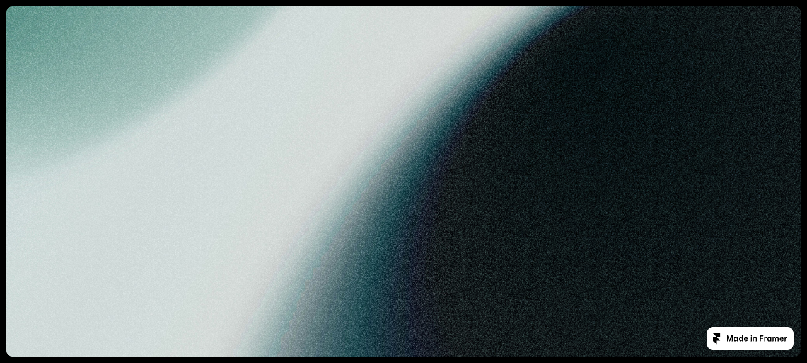
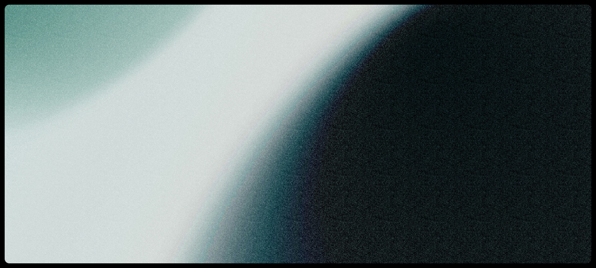
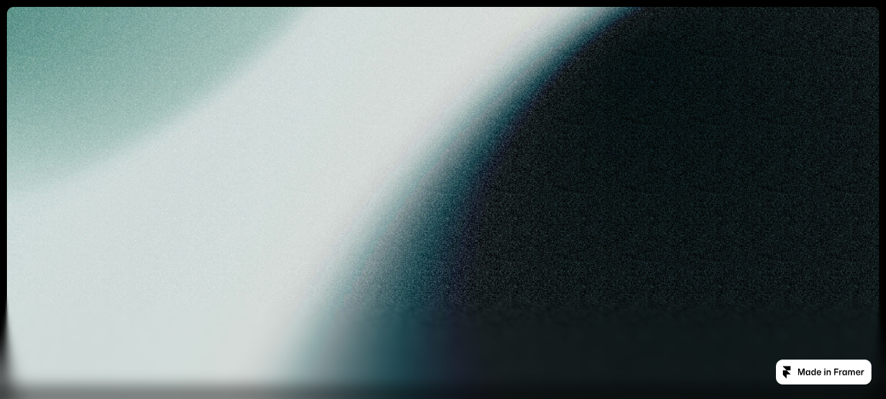
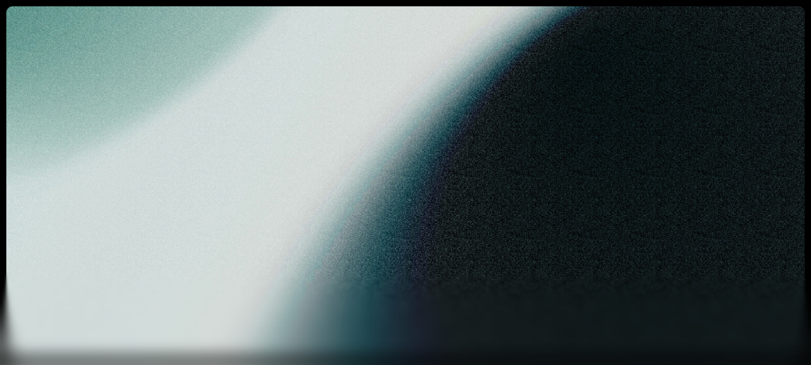

# Scroll blur footer

## Goal

Make the effect from https://scrollingblur.framer.website/ an installable React component. No iframe, remote HTML, Framer runtime or remote JavaScript.

Preserve the six-layer progressive backdrop blur, scroll-activity trigger, spring response and 180ms inactivity delay. The component is an overlay, not a footer content template.

## Source and proposed preview

Pinned source: [HTML](../../reference/scroll-blur-footer/index.html), [page implementation](../../reference/scroll-blur-footer/page.mjs), [motion runtime](../../reference/scroll-blur-footer/motion.mjs).

[Open the runnable proposed preview](preview.html). Scroll, stop and reverse. The preview uses the proposed React component bundled with local React and Motion packages. Its image still comes from the source host during this isolated preview.

| Source | Proposed preview |
| --- | --- |
|  |  |
|  |  |

The fixed bottom overlay is 150px tall with z-index 7. Each layer covers the overlay. Its mask runs toward the top, progressively stepping through sixths of the height. The layer blur coefficients are 2, 4, 6, 8, 10 and 12px, all multiplied by one animated strength value.

Scroll starts a spring to strength 1, stiffness 300 and damping 30. Continued scroll resets the inactivity timer. After 180ms without a scroll event, a spring returns to strength 0, stiffness 80 and damping 26. New scrolling interrupts that return.

## Comparison evidence

Matched Chromium viewport, 1280 by 577, scroll position 0, identical responsive image, strength 0 and strength 1. Both endpoint comparisons report 0 changed pixels among 727,170 compared pixels. [Results](comparison.json), [reproducible comparison](compare.py).

The Framer hosting badge rectangle is excluded because it is not part of the effect. The fixed comparison tolerance is a maximum channel difference of 8 and no more than 0.1% changed pixels. No tolerance changes were made. The first comparison failed because the source selected a 2048px responsive JPEG while the preview used the original 5120px JPEG. Matching the exact selected asset resolved that setup difference. [Initial result](comparison-before-matched-image.json).

These screenshots verify the endpoint appearance only. A browser scroll check confirmed that the proposed blur returns to zero at rest. Transition timing, interruption, nested scrolling, mobile rendering and reduced-motion behavior need their implementation checks below.

## Implementation

- `src/registry/scroll-blur-footer.tsx`: standalone overlay using React and the npm `motion` package. Props: `direction`, `height`, `position`, `className`, `style`. Source defaults are bottom, 150px and fixed. Absolute positioning supports bounded demos. Capture-phase passive scroll listening preserves the source's nested-scroll behavior. Clean up animation, timer, preference listener and scroll listener on unmount.
- `src/components/demos/scroll-blur-footer.tsx`: two image sections inside a bounded scroller with an absolute overlay. Reuse the installable component directly.
- `src/components/previews/scroll-blur-footer.tsx`: fullscreen scroll scene using the same source image and overlay. No added captions or footer wording.
- Add catalog, demo, preview, metadata and group entries in their existing indexes. Declare `motion` as the installable dependency.
- Upload the source image to Vercel Blob before registering it in `src/lib/assets.ts`. Demo and preview will use the registered hosted URL. The installable blur component has no image dependency.
- `tests/scroll-blur-footer.test.mjs`: compare constants and masks against the pinned source, exercise scroll activation and inactivity, interruption, cleanup and reduced motion. Include the suite in `npm test`.

## Allowed departures and checks

The effect remains decorative and pointer-transparent. Reduced motion disables the scroll-triggered blur and responds to preference changes. This is an explicit accessibility departure from the source.

Do not reproduce the Framer hosting badge, canvas-editing tint or purchase controls. Do not redesign the image composition or add explanatory UI.

Verify the real catalog demo and fullscreen preview at desktop and mobile sizes. Exercise nested scrolling, direction reversal, stop and resume during fade-out, reduced motion and unmount. Check console errors and pointer access to underlying content. Rerun source-value tests and screenshot comparisons against the pinned source. Run registry integrity, portrayal, typecheck and scoped lint checks.

Preview files are isolated under `.plannotator/scroll-blur-footer/`. No production component or registry entries have been changed yet. Image redistribution permission is not established by the public source; the image can be replaced separately if needed without changing the installable effect.
