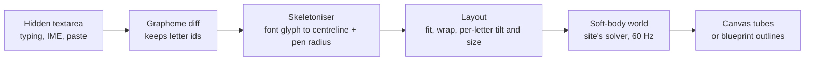
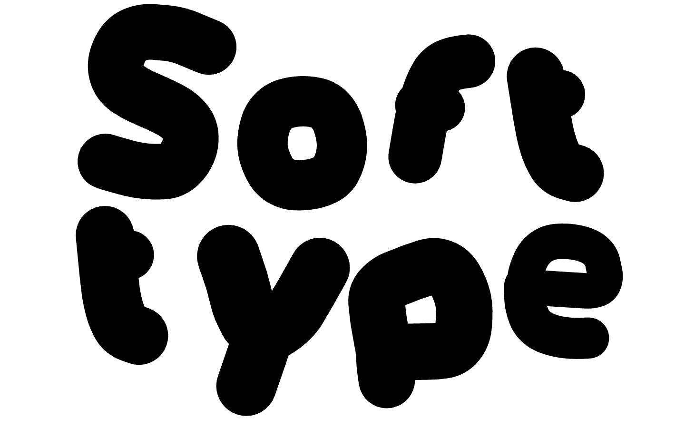
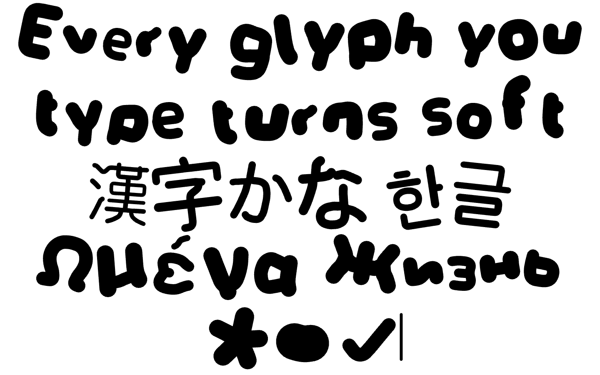
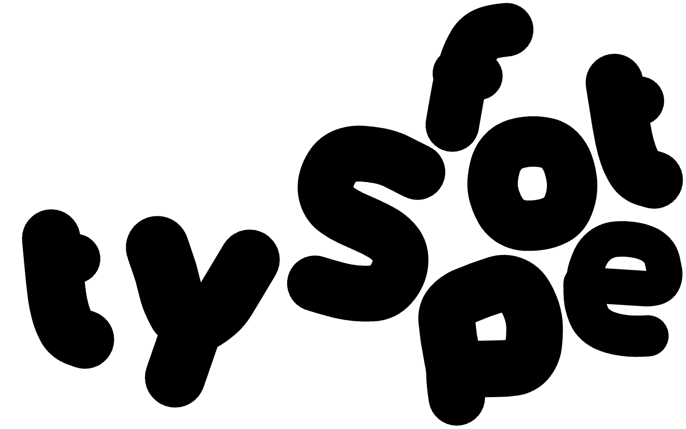
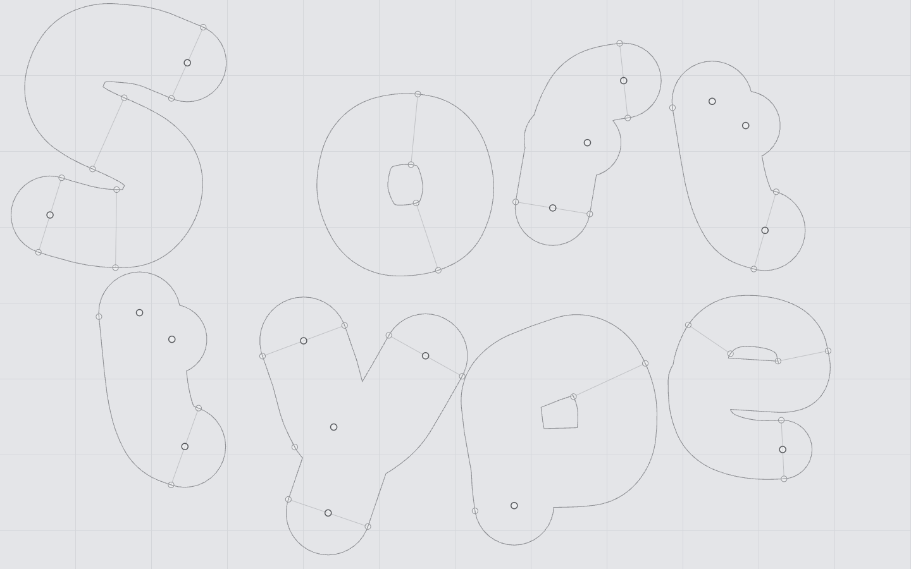
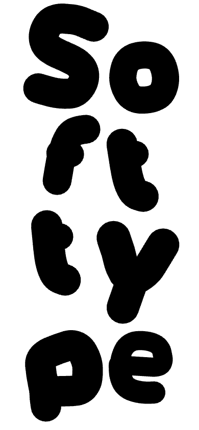
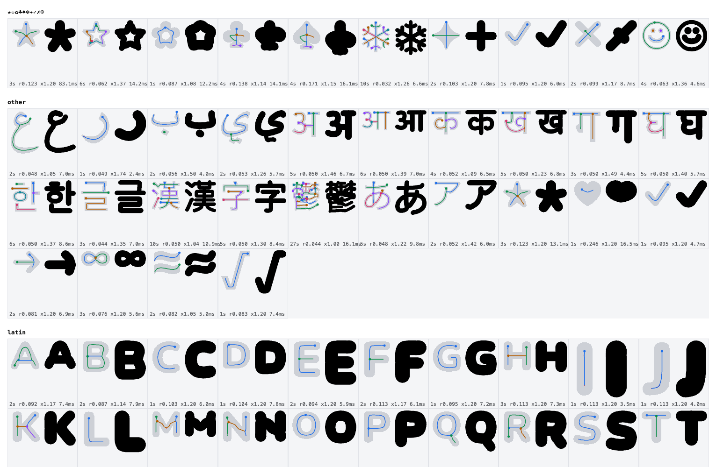
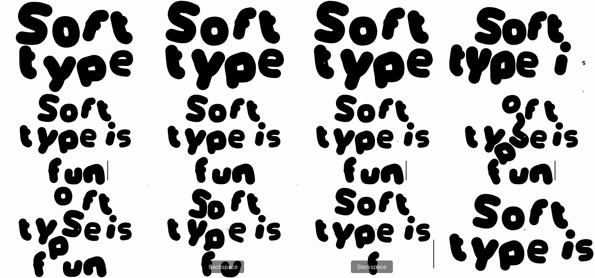
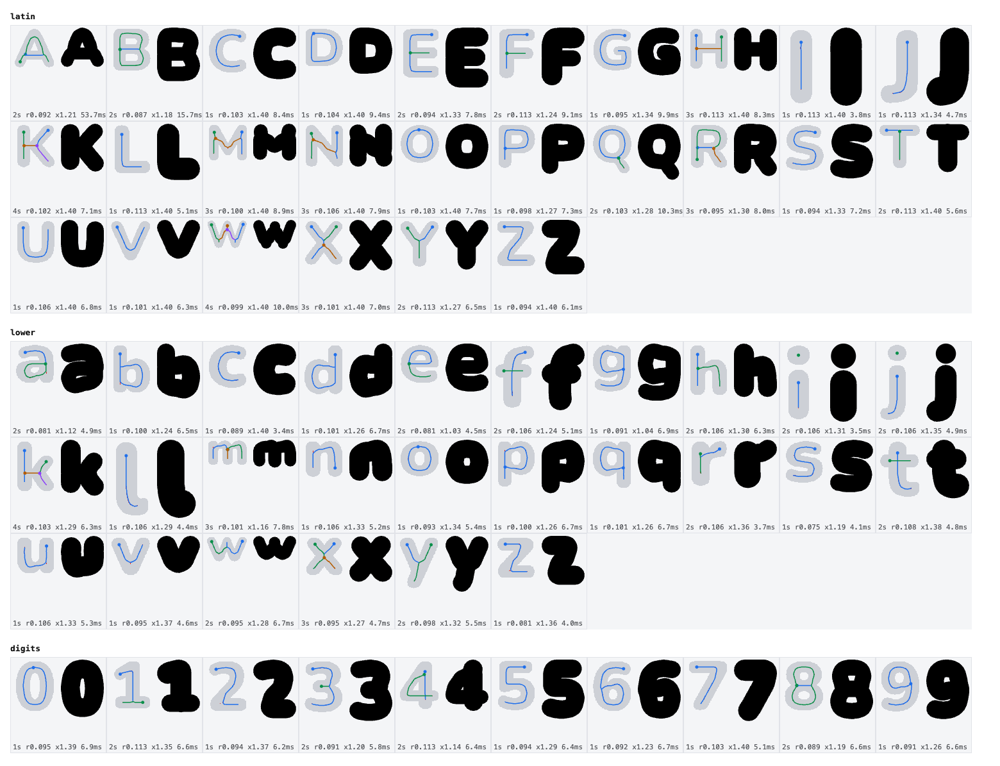
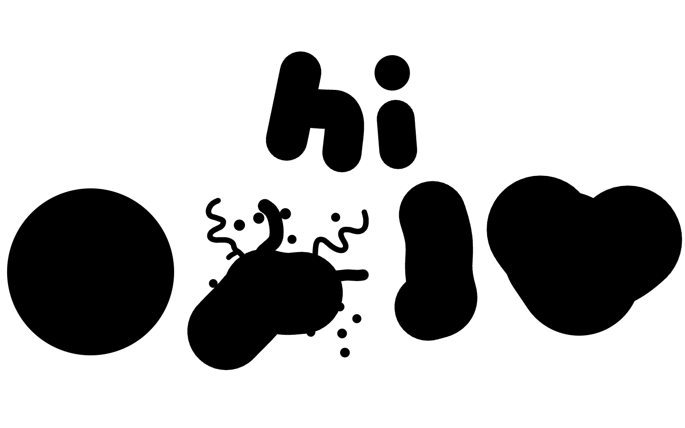

# Soft Type: type anything, every glyph becomes a squishy letter

## Goal

- **Problem.** colederochie.com's draggable bubbly lettering only works for 8 hand-drawn letters (C O L E D R H I). Its look comes from monoline skeletons drawn with a fat round pen, not from a font.
- **Result.** A registry component, `soft-type`. You type into it (any script, symbols, IME, paste, phone keyboards). Each grapheme becomes a soft body with the site's physics: drag to squash, letters shove each other, press and hold to pop into blueprint mode.
- **Proof.** A working lab (Proposed preview) at `https://soft-type.compronents.localhost:1355/play.html`, a skeleton inspector covering 12 scripts, and a webreel recording of the typing, drag and reflow flow.

## How it works

1. **Skeletoniser** (new, the hard part). Draws the grapheme in Nunito 1000 on a hidden canvas. A rounded heavy letter is almost exactly a centreline swept by a round pen, so the 1 px medial axis is the pen path and the distance transform along it is the pen radius. Thinning, graph tracing, spur pruning by depth (a real stroke ends a radius deep inside its round cap, a corner spur runs out to the edge), strokes chained straight through junctions. 3 to 10 ms per glyph, cached.
2. **Weight.** Pens fatten toward 1.2× the font's own, capped per glyph so no counter closes or loses more than half its area and no aperture seals shut. This is the site's rule ("as bold as possible with counters still open"), applied to any glyph. A minimum pen lifts thin fallback fonts (Han, Devanagari) toward Nunito's weight.
3. **Physics.** Same solver and constants as the site (studied in `.colederochie-analysis/STUDY.md`): particles every 0.6 pen radius, welded junctions, braces, link stiffness 0.24, bending 0.18, shape spring 0.024 with no rotation term, 1.8 px contact gap, anti-tunnelling substeps, 0.94 damping, at most one tick per frame, sleep when quiet. Hold to pop: 150 ms, 1.1 s grow to 2×, 0.6 s tremble, elastic pop, synthesised pop sound, toggles blueprint.
4. **Typing.** Scritto-style prefix/suffix diff over graphemes (`Intl.Segmenter`), so editing the middle keeps every other letter's physics. New letters grow in with an elastic overshoot, staggered 33 ms apart; deleted ones shrink out. After each keystroke every letter springs to its new slot for about 4 s, then the arrangement is yours to push around, as on the site. Escape lines everything up again.

## Proposed preview

All images are from the lab at 1440×900 unless noted.

| Default text, settled | Mixed scripts typed |
| --- | --- |
|  |  |

| Dragged S, others make room | Hold to pop: blueprint mode |
| --- | --- |
|  |  |

| Phone, 390×844 | Skeletons: mask, traced strokes, re-drawn tube |
| --- | --- |
|  |  |

Recording (webreel, `webreel.config.json` → `type-drag-reflow`): type, reflow to three lines, drag the S into the middle, backspace re-homes everything, type Han.
[videos/type-drag-reflow.mp4](videos/type-drag-reflow.mp4)

Full Latin, lowercase and digit skeletons at weight 1.4 (the per-glyph cap is the `x` number): 

## Emoji: a circle (decided)

Every emoji grapheme (`\p{Extended_Pictographic}`, flags, keycaps, skin-tone and ZWJ sequences) becomes one squishy filled circle in ink, about cap height. It is built as a closed ring of particles whose pen radius equals the ring's radius, so the tube covers the whole disc and still squashes, drags and pops like a letter. 😀 already looks like this today; 🎉 and 👍🏽, which currently fall apart into pieces, get the same circle:

## Other choices I made (say if you want them different)

- **Default text `BLANK`**, per the registry's branding rule. The input's screen-reader label is "Type to change the letters". There is no visible hint or caption; the caret and the letters already explain it, and hold-to-pop stays an easter egg as on the site.
- **Phones break words mid-word** to keep letters big (`So / ft / ty / pe`). The site does the same (COL / EDE / ROC / HIE). A `breakWords` prop turns it off.
- **Typing makes a soft blip** much quieter than the pop. `sound={false}` silences both.
- **Departures from the site, and why:**
  - Pen radius per stroke, so accents and thin rings keep the font's weight.
  - Separate pieces (an i's dot, umlauts, most Han strokes) are tied together. The site has no such pieces; without ties, one knock scatters them.
  - A letter still growing in passes through others, and contact pushes are capped at about a third of the thinner pen. Without these, typing a Han character next to a big one knotted its strokes (measured 670% link strain, now under 120% for about 80 ms).
  - A letter left knotted for 0.75 s eases back to its rest shape.

## Files

Production (after approval):

| File | Responsibility |
| --- | --- |
| `src/registry/soft-type/index.tsx` | React component: props, font loading, mounts the controller |
| `src/registry/soft-type/controller.ts` | Canvas, hidden textarea, grapheme diff, frame loop, pointer, hold-to-pop, sound, caret |
| `src/registry/soft-type/engine.ts` | `Body` and `World`: the soft-body solver |
| `src/registry/soft-type/skeleton.ts` | Glyph to centreline, per-stroke radius, counter-safe weight |
| `src/registry/soft-type/layout.ts` | Fit, wrap, per-letter pose and caret slots |
| `src/registry/soft-type/render.ts` | Tube and blueprint drawing |
| `src/lib/registry.ts` | Registry entry (Text category) |
| `src/components/demos/soft-type.tsx` + index | Demo |
| `src/components/previews/soft-type.tsx` + index | Fullscreen preview |
| `src/components/studios/soft-type.tsx` | Studio: pen weight and squeeze sliders, ink and paper colours, sound (shared `SliderComfortable`, `StudioColor`) |
| `src/lib/component-meta.ts` | Props and nuance notes |
| `tests/soft-type.test.mjs` | Grapheme diff keeps ids through middle edits; layout fits and wraps |

The lab under `.plannotator/soft-type/` (inspector, play page, webreel config) stays as review material and is not wired into any route.

## Limits and unverified

- Glyph coverage is whatever the device's fonts can draw; a missing glyph renders as the browser's fallback box, skeletonised.
- ✗ (ballot X) still loses one stroke; a few brush-style symbols may trace imperfectly.
- Very long text with dense Han is heavy: 55 graphemes, 1,193 particles, 3.5 ms per physics step on this Mac. Not yet measured on a phone. `maxLength` defaults to 64.
- Not yet checked: Safari (where `ui-rounded` exists), iOS keyboard opening on tap, right-to-left text order (Arabic letters currently lay out left to right).
- The lab was verified in Chrome via Agent Browser and webreel only. The production component gets the same named flow re-recorded and an interactive pass after implementation.
