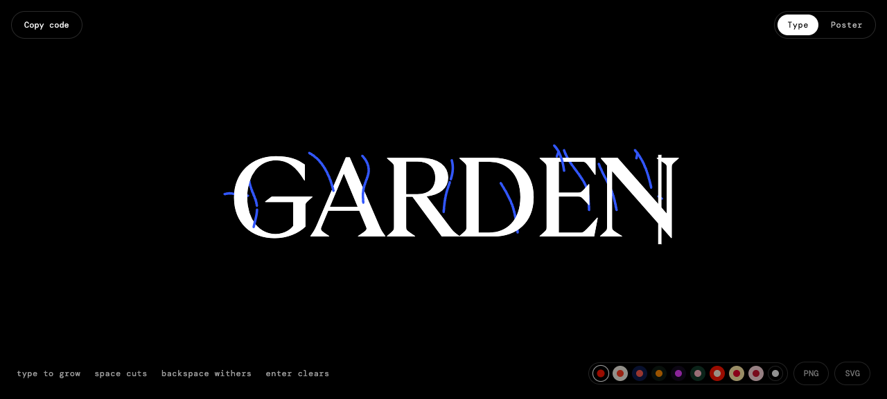
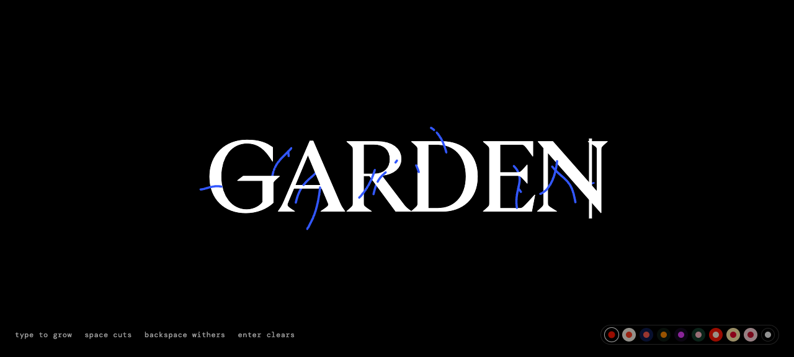

# Type Garden core component

## Goal
Reproduce the linked Type Garden typing scene as installable `type-garden`, without the Copy code control, Type/Poster switch, poster editor, PNG/SVG export controls, or export shortcuts. Keep the live type-to-grow behavior, pointer response, palette choices and short keyboard hints.

## Source and representative proof
- Pinned source: `reference/type-garden/index.html`, an HTML bundle containing the original template, runtime and fonts. `reference/type-garden/unpacked.html` is the decoded source template.
- Mechanism: a 2D canvas draws each typed glyph in GT Ultra and generates vines, leaves and roses around letter geometry. Space cuts the current vine, Backspace withers the previous letter, Enter clears. Pointer position bends vines and can summon a butterfly.
- Isolated proof: `.plannotator/type-garden/core-proof.html`, built by `.plannotator/type-garden/strip-source.py`. Open it as a local file. It runs the original bundle after deleting the named controls from the template, not covering them with CSS. `core-proof.png` shows the empty scene; `core-garden.png` shows `GARDEN` growing. Compare with `source-garden.png` at 1280 × 577. The font, glyph placement, and drawing mechanism remain; vine geometry varies because the source seeds each word at runtime.

## Files and responsibilities
| File | Change |
| --- | --- |
| `src/registry/type-garden.tsx` | Client frame that fetches the pinned, trimmed HTML from the project's asset route, isolates the original document and fills its parent. |
| `src/components/demos/type-garden.tsx`, `src/components/previews/type-garden.tsx`, indexes | Bounded demo and fullscreen preview. |
| `src/lib/registry.ts`, `src/lib/registry-groups.ts`, `src/lib/component-meta.ts` | Register under Text effects and document the minimal wrapper API. |
| `src/lib/assets.ts` | Register the single self-contained `type-garden/core.html` Blob asset. |
| `tests/type-garden.test.mjs`, `package.json` | Compare generated template against pinned source with only the authorized deletions, check excluded controls, and include the test. |
| `reference/type-garden/*` | Pinned source capture and decoded template. The capture contains base64-encoded source resources, but no separate font or image files. |
| Vercel Blob `type-garden/core.html` | Store modified self-contained HTML first, then reference it through `/assets/`. |

## Decision-bearing changes
- Remove actual template nodes for `data-tg="modes"`, `isPoster`, PNG/SVG buttons and the separate Copy code block. Disable the Ctrl/Cmd+S export shortcut. Preserve the runtime's type-mode state and rendering functions unchanged otherwise.
- The original bundle has 12 embedded resources, including its fonts and runtime. Package one derived HTML document, rather than replacing the font or drawing the vines ourselves. Fetch as text and pass to `iframe.srcDoc` because Blob may deliver HTML as a download; this also works on another host when the asset route redirects to Blob.
- Scope the source's global keyboard/pointer handlers and CSS to the frame. The component exposes only `className`, `style` and an accessible `title`; it does not add a second UI.

## Checks and limits
- Compare matched viewport screenshots at 1280 × 577 for empty and typed states, then mobile. Interact with typing, Space, Backspace, Enter, pointer and palette buttons. Verify removed controls are absent from the DOM and Ctrl/Cmd+S does not export.
- The preview site's close control may sit over Type Garden on mobile; move that registry chrome only if it actually blocks a retained control.
- Verified implementation at `https://compronents.localhost:1355/components/type-garden/preview`: screenshot `.plannotator/type-garden/local-garden.png` at 1280 × 577, plus `local-mobile-bloom.png` at 390 × 844. Typing BLOOM, selecting Paper, Backspace, Space and Enter ran in the browser. The accessibility tree showed the input and ten palettes, with no Copy code, mode switch or export buttons. No console errors appeared.
- Measured desktop comparison with `source-garden.png`: background region 0 / 101,200 differing pixels above RGB threshold 24; glyph region 17,301 / 105,400 or 16.41%, driven by stochastic vine geometry and different capture time. The hint/control region differs because the requested controls are gone. Mobile preview close control does not overlap a retained control; the Next.js dev indicator covers part of the palette in development only.
- `tests/type-garden.test.mjs` verifies reproducible generation and absent controls. Registry and portrayal suite 868/868 passed; Biome and full TypeScript checks passed. Hosted HTML SHA-256 matched `reference/type-garden/core.html` at upload time.
- The source bundle has no license statement identified yet. Confirm redistribution rights before public release. The compiled runtime remains a pinned external artifact, not maintainable TypeScript. Reduced-motion behavior is inherited from the source and was not separately verified.
