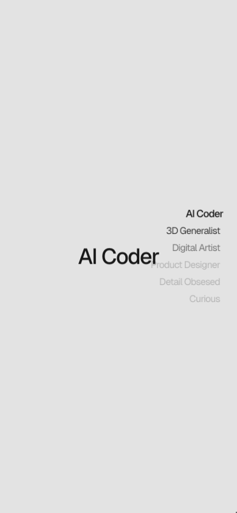
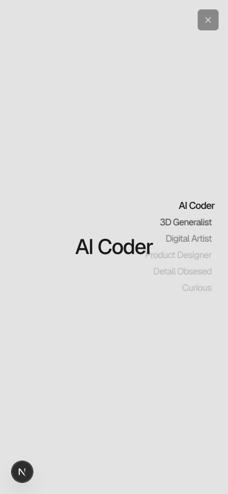

# Vertical dial nav implementation evidence

Date correction pushed to main as `2ba4714`. Vertical dial implementation remains local pending implementation review.

App URL: https://compronents.localhost:8443/components/vertical-dial-nav/preview

Portless fallback uses TLS on port 8443 because unattended sudo was unavailable for 443. The pnpm executable points at a missing installation, so validation used npm and installed local tool binaries. No dependency versions changed.

## Observed behavior

- Clicking Digital Artist scrolls the inner container to section 03 and updates active color, weight, scale and distance fade.
- Keyboard Enter on Curious reaches the last section, preserves window scroll at zero, and shows a visible focus outline.
- Activating Digital Artist then Product Designer before completion reaches Product Designer.
- Reverse scrolling to 1.8 viewport heights selects Digital Artist at the 30% threshold.
- At 390 × 844, reduced motion changes transitions to none and link navigation to instant. The scene itself has no horizontal overflow. The source's mobile heading/nav overlap is preserved, not redesigned.
- Unit integration test covers window and offset nested-root thresholds, link activation, reduced motion and frame cancellation on unmount.
- No browser errors observed during the exercised preview flows.

## Visual evidence

The original source mechanism and exact transitions were adopted. The nav does not rotate or shift the whole label list. The original Geist 400 and 500 fonts were uploaded byte-for-byte to Blob, registered and served through /assets. Font download/upload hashes are in reference/vertical-dial-nav/fonts.json.

Desktop screenshots, source and implementation at 1280 × 577:

Mobile at 390 × 844:

Matched source and implementation captures for desktop first/middle/last and mobile first/middle are listed in captures.json. capture.mjs waits for selected state, correct scroll position, fonts and CSS transition completion. Screenshots remain local and are not committed as binaries.

### Comparison qualification

Element-only capture of the source nav returned a blank image because of blend-mode/capture interaction. That comparison was invalid. The corrected setup crops the nav from full viewport captures at the measured coordinates. Framer edit UI and watermark are hidden before source capture. No navigation pixels are masked.

The final Argent screenshot-diff for the desktop middle nav reports 0.42% pixel mismatch, localized to text, and no OCR text changes. This is not a zero-difference result. Exact pixel fidelity is not established.

An independent exact RGB comparison, without a tolerance, reports 0.61% to 2.01% changed nav pixels across the five states. These measurements are not interchangeable with Argent's mismatch score. pixel-summary.json preserves the exact results and the difference images remain in this folder. The source constants and 360 tested fade cases agree exactly. Visual rasterization differences remain explicit.

## Validation

- npm test passes, 1,084 tests, zero failures.
- npm run typecheck:registry passes.
- Scoped Biome on all changed production/test files passes.
- Production build passes, 3,230 static pages generated. Existing broad file-tracing warning remains.
- Font asset route redirects to the uploaded Blob pathname, and downloaded hosted hashes agree with the pin manifest.

## Intentional differences

Explicit nested-scroll-root support, ancestor-safe link scrolling, cleanup, reduced-motion handling and keyboard focus styling. The demo uses scoped font family names to avoid changing other components. The installable nav accepts font styling; hosted fonts belong to the demo rather than imposing font downloads on consumers.

No dependency additions, unrelated restyling or edits to existing components.

## Local tooling note

Argent reported that v0.27.0 is available. No update was initiated. This is a session-only note, not project memory.
