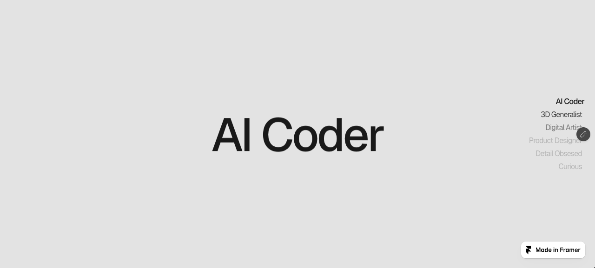

# Vertical dial nav

## Goal

Add the linked Framer navigation as an installable BLANK registry component, with its own demo, fullscreen preview, documentation and studio controls. Preserve the source's appearance and scroll-selection mechanism rather than inventing a rotating wheel.

The release-date correction was pushed separately to main as `2ba4714`.

## Source and representative preview

[Original](https://miracle-building-262247.framer.app/)

Pinned artifacts live in `reference/vertical-dial-nav/`. `shared-lib.mjs` contains the component function `mo`, its defaults and the published page props. The HTML contains the original CSS. These are the implementation authority.

[Runnable isolated preview](preview.html)

### Current source, desktop at 1280 × 577

### Proposed preview, Digital Artist selected at 1280 × 577

These captures show different selected sections, not a pixel comparison. The preview is isolated HTML, not a production React component. It reproduces the navigation selection and styles. It does not yet reproduce the heading entrance spring, implement registry integrations or support nested scroll roots. Visual fidelity remains unverified until matched-state pixel comparisons.

Verified preview interaction: clicking Digital Artist brings section 03 to viewport top, assigns aria-current to that link, and settles the six opacities to 0.466667, 0.733333, 1, 0.733333, 0.466667, 0.2.

## Mechanism and preserved values

1. Scroll or activate a section link.
2. Select the last section whose top is at or above 30% of the scroll viewport.
3. Update active color, weight, scale and the neighboring labels' opacity.

Preserve the published settings: right alignment, 180px nav inside a 200px fixed wrapper, 430px height, 12px gaps, 16px Geist, -0.05em letter spacing, zero dial radius and fade distance 2. The active link has scale 1.06 and weight 500, others have weight 400. Opacity is 1 for the active item, 0.2 beyond fade distance, otherwise `1 - distance / (fadeDistance + 1) * 0.8`. Transitions use 0.4 seconds and cubic-bezier(.4,0,.2,1).

The source centers the complete link list. It does not shift the selected label into the middle, rotate labels, add dial ticks or change the list geometry. Preserve that behavior, including its clipping.

Keep the six source labels, section colors and responsive heading sizes. Preserve the source heading spring with stiffness 180, damping 30, mass 1, delay 0.4 and initial y 80. Do not add instructional subtitles or extra decorative UI.

## Files and responsibilities

- `src/registry/vertical-dial-nav.tsx`: portable typed React navigation, no Framer dependency. Section IDs and labels, active color, fade distance, font styling, dial dimensions, spacing and alignment. Explicit optional scroll-root support for bounded consumers.
- `src/components/demos/vertical-dial-nav.tsx`: bounded scrolling example using the real component and source presentation.
- `src/components/previews/vertical-dial-nav.tsx`: full-height source presentation using the actual fullscreen scroll root.
- Existing demo and preview indexes: register the new wrappers.
- `src/lib/registry.ts`: register Vertical Dial Nav, category Layout, release date 2026-10-08, portable source and dependencies.
- `src/lib/component-meta.ts`: real API documentation, source mechanism notes and controls using shared studio controls.
- `tests/vertical-dial-nav.test.mjs`: compare extracted constants and mechanics against the pinned source, then focused scroll-root and selection checks.
- `package.json`: include the focused suite in existing test scripts where needed.
- `src/lib/assets.ts`: only if the source font needs a new Blob registration. Reuse existing hosted Geist if source-equivalent. Upload any needed binaries before wiring them. Never commit font or screenshot binaries.

Read each production file in full before editing. Existing components and unrelated metadata stay unchanged.

## Necessary integration differences

The source observes window scrolling. The registry preview scrolls inside a container. Add explicit root support, with window as the ordinary standalone default. Measure the 30% selection threshold relative to that root and avoid scrolling unrelated ancestors.

Add visible keyboard focus only during keyboard interaction, proper lifecycle cleanup, and reduced-motion behavior. Reduced motion removes smooth scrolling and nonessential transitions but preserves selected-state appearance. These are intentional departures limited to accessibility and integration, not a restyle.

## Acceptance and omissions

- Test direct clicks, keyboard activation, ordinary wheel scrolling, reverse scrolling, interruption and resizing.
- Verify both window and bounded root modes, plus initial restored scroll and component remount cleanup.
- Inspect desktop and phone at matched viewports against the pinned source, including active first, middle and last sections. Establish comparison masks for the Framer edit badge and watermark before capture, never mask navigation differences. Keep pixel-diff results with this plan.
- Assert source constants and opacity formulas against the pinned bundle.
- Run relevant registry integrity, portrayal, typecheck, scoped lint and build checks.
- Do not claim fidelity if a required comparison cannot run.
- No rotary wheel, ticks, radial transforms, new assets or unrelated page redesign.
- No production implementation before approval. The isolated preview and research files are local preparation only.
