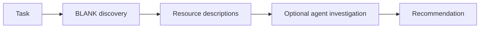
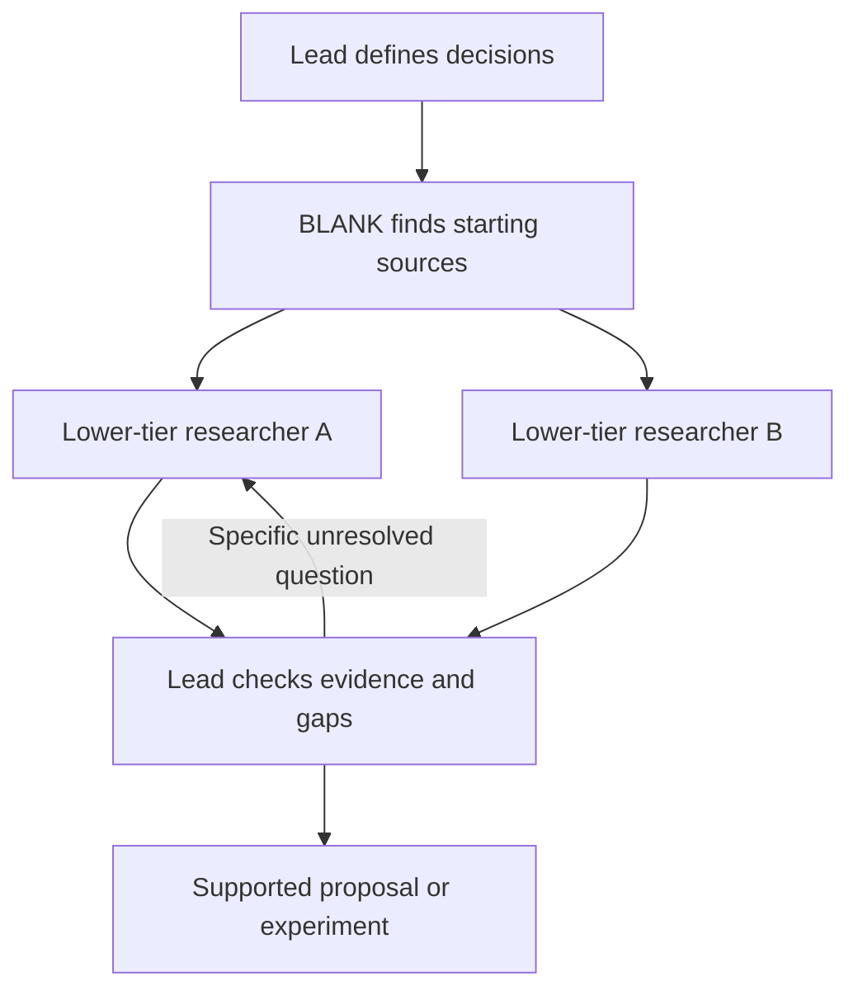

# Research workers that investigate and apply sources

Research date: 2026-09-22. Source checkout: `bef5865a35dee437d3b7354afe40d15b8b19bc2b`.

This is a research recommendation, not an implemented workflow or an approved implementation plan. Existing unrelated component changes were left alone.

## Recommendation

Use a capable lead agent with lower-tier research workers for open design and engineering questions. The lead owns the brief, selects independent questions, verifies consequential findings and makes the final decision. Workers search inside resources, read the relevant material and run small authorized experiments. Their output must contain source evidence and its application to the task.

Start with two workers when there are two useful independent questions. Use one for a focused source investigation and a third only for a distinct unresolved question. A narrow edit or a fact already established in the current source needs no research team. These are proposed defaults for our work, not universal limits established by research.

The important change is the completion requirement. Finding a resource starts an investigation. A supported decision, useful rejection or clearly identified unresolved question completes it.

## What we checked

- Read the current BLANK engagement rules, MCP response construction, stored-source inspection path and source ingestion path.
- Ran BLANK discovery and four differently focused lookups. Scanned all ten initial candidates. Feynman and Google Research were useful starting sources. Other initial results included design directories, CI tooling and unrelated agent infrastructure, which did not answer this question.
- Followed Feynman from its homepage to the actual deep-research workflow at a pinned repository revision. Used Context7 to locate documentation, then checked the real source file instead of relying on snippets.
- Two researchers read primary sources on delegation and evaluation. A third worker used `gpt-5.6-luna` for a bounded source-investigation trial after the user explicitly requested a lower tier.
- The lead independently read Anthropic's tool-design article and checked the research-system article's model hierarchy, delegation requirements and cost comparison.
- The lead checked the lower-tier worker's decisive findings against Google's blog and the revised paper. The blog reports 180 configurations; paper v3 reports 260. The worker received a paper pointer and a warning about its error metrics from the lead during the investigation, so this was an assisted trial, not a blind model comparison.

Supporting notes: [delegation](source-investigation-delegation.md), [evaluation](source-investigation-evaluation.md), and [lower-tier worker trial](source-investigation-worker-trial.md).

## What the sources changed

| Source inspected | Mechanism | Decision |
| --- | --- | --- |
| [Anthropic's research system](https://www.anthropic.com/engineering/multi-agent-research-system) and its linked [worker prompt](https://github.com/anthropics/anthropic-cookbook/blob/daac2acb91544767804e42cf720df07c232fd5b6/patterns/agents/prompts/research_subagent.md) | A lead assigns independent investigations with an objective, boundaries, source guidance and an output format. Workers fetch full sources and revise their search as gaps emerge. | Adopt the lead/worker division and source-level investigation. Reject mandatory fanout and contradictory call budgets in the sample prompts. |
| From wall: [Feynman](https://www.feynman.is/), `insp_feynman`, followed to [deepresearch.md](https://github.com/companion-inc/feynman/blob/dfdcb7cf2c73183cff7b10aa8ea8ce370c8b152c/prompts/deepresearch.md) | Separate research files, lead-owned synthesis, citation verification, a support review and durable provenance. It checks child completion and output existence before using results. | Adapt durable evidence and explicit partial/blocked outcomes. Do not adopt the entire tool or its document-heavy workflow. This was source inspection, not a Feynman runtime trial. |
| [Writing effective tools for agents](https://www.anthropic.com/engineering/writing-tools-for-agents) | Tools should fit the actual workflow, return actionable context and be tested through realistic tasks and transcripts. More tools are not automatically better. | Start with existing browser, file and execution tools. Repair the missing response guidance before adding a new hosted research service. |
| [ALCE](https://arxiv.org/html/2305.14627v2) | Correctness, citation support and citation relevance are different properties. Attaching citations after generation can hide weak grounding. | Capture evidence with each finding before synthesis. Checking that a URL opens is insufficient. |
| [Demystifying agent evaluations](https://www.anthropic.com/engineering/demystifying-evals-for-ai-agents) and [Scaling agent systems, v3](https://arxiv.org/html/2512.08296v3) | Grade outcomes and evidence, repeat trials, and account for task-dependent coordination costs. | Compare stronger single-agent research with tiered delegation. Measure useful decisions and cost per successful task, not activity. |

The Anthropic and ALCE sources supplement BLANK's returned starting points. They are external primary sources used for the specific delegation, tool-design and evaluation questions, not uninspected resource recommendations.

Anthropic reports an Opus 4 lead with Sonnet 4 workers outperforming a single Opus 4 on its internal research evaluation. This supports the feasibility of a tiered team, not equivalence between arbitrary cheaper and stronger models. Its roughly 15-times token figure compares multi-agent systems with chat. It is not a price estimate for BLANK or an equal-budget comparison with a single researcher.

Feynman's actual [researcher prompt](https://github.com/companion-inc/feynman/blob/dfdcb7cf2c73183cff7b10aa8ea8ce370c8b152c/.feynman/agents/researcher.md) also shows why we should inspect instructions before adopting them. It requires at least five source entries and says that zero search results mean a thing does not exist. Reject both rules: source count does not establish depth, and a failed query does not establish absence. Its [verifier prompt](https://github.com/companion-inc/feynman/blob/dfdcb7cf2c73183cff7b10aa8ea8ce370c8b152c/.feynman/agents/verifier.md) has a useful stronger requirement to verify meaning rather than topic overlap. Adapt that requirement while keeping evidence attached to findings from the start.

## Current behavior and the gap

Current path:



The optional step is where depth is lost. The rules already tell agents to investigate, but the tools do not track or check completion of that work.

| Current source | Verified behavior | Consequence |
| --- | --- | --- |
| [engagement strategies](../../src/lib/inspiration-engagement.ts#L14) | Defines an instruction and `evidenceRequired` per engagement strategy. | The intended distinction between finding and investigating already exists. |
| [Markdown formatter](../../src/lib/inspiration/compat.ts#L48) | Emits `Next action`, but not `evidenceRequired`. | The agent gets an action without the corresponding finish requirement. |
| [JSON response](../../src/lib/inspiration/compat.ts#L109) and [hit type](../../src/lib/inspiration/types.ts#L60) | Returns raw retrieval results without the computed engagement strategy. | Structured callers lose guidance available in Markdown. |
| [inspect operation](../../src/lib/inspiration/http.ts#L25) | Returns saved passages, preferences and ingestion jobs. | An inspect call is not live research inside a library, collection or book. |
| [ingestion](../../src/lib/inspiration/ingest.ts#L362) | Fetches only the curated URL. | A book landing page does not supply its chapters; a library homepage does not supply every component. |
| [direction skill](../../.agents/skills/blank-direction/SKILL.md) | Caps source inspections at three and counts access failures against that budget. | It does not clearly distinguish three starting collections from the deeper pages needed inside them. |

The current tools can encourage research but cannot force an arbitrary host agent to perform it. Reliable execution needs both host-side delegation and observable evidence. A new MCP field alone would still be an instruction, not enforcement.

## Proposed workflow



1. The lead reads the current product and frames the decisions that remain open. This is a research brief, not a design already chosen before discovery.
2. BLANK supplies starting sources. The lead selects relevant ones and assigns independent questions with enough product context to answer them.
3. Workers use the host's real browsing, reading and execution tools. They follow source-internal search, catalogs, tables of contents, examples and useful original links. Each records what was actually examined.
4. Workers return findings with evidence, applicability, limitations and a proposed choice or rejection. Full notes remain in separate files; the lead receives a compact summary and artifact references.
5. The lead opens the evidence supporting each decisive finding, compares alternatives and challenges contradictions. It requests a focused follow-up or raises the worker's model tier when the remaining task exceeds that worker's demonstrated ability.
6. The result becomes a section proposal, a pattern mapped to our code, or a small experiment. If the user requested research only, a supported recommendation is sufficient. Production implementation follows the normal review process.

### Model routing

| Role | Proposed model policy | Responsibility |
| --- | --- | --- |
| Lead | Keep the capable model selected for the task | Brief, decomposition, source checks, synthesis and final judgment |
| Research worker | Configured lower-tier model with the required tools | Internal source search, reading, extraction, comparison and bounded experiments |
| Escalated worker | Stronger model only for a named unresolved difficulty | Ambiguous technical reasoning, conflicting evidence, difficult navigation or an experiment the first worker could not assess |

Use a named worker-model setting rather than silently inheriting the lead model. In this environment the trial explicitly selected `gpt-5.6-luna`. Its price and quality relative to alternatives were not measured. Choose the cheapest tier that passes the task evaluations, not the cheapest advertised tier regardless of capability.

Before escalating a model, distinguish missing access from reasoning difficulty. Authentication, unavailable browser capability or a broken tool need a capability or access fix. Paying for a stronger model does not itself fix those conditions.

Give workers a concise brief and required context rather than the whole conversation. Include the actual user constraint, relevant source/code locations, existing decisions and what other workers own. Do not omit context required to judge fit merely to reduce tokens.

Use the host's native subagent facility. BLANK should supply portable research instructions and source metadata, while Codex or another host supplies process control and model selection. A server-side research service is unnecessary for the first trial. If the host cannot select a worker model, disclose that fact rather than claiming tiered execution.

### Example: "Think of a UI for this section"

The lead first identifies the section's job, content and constraints. Suppose the unresolved choices are information hierarchy and interaction behavior.

- Worker A investigates the strongest visual collection. It searches within Are.na or Pinterest, examines individual works, follows relevant originals and returns annotated observations about hierarchy, density and progression. The board's title is not evidence of its visual content.
- Worker B searches the recommended component library for patterns that fit the actual content and states. It examines concrete demos and implementation, then evaluates the best candidate against keyboard, mobile and data constraints relevant to this section.
- The lead compares those findings and produces a coherent proposed section. It does not ask each worker to independently design the entire section and average their outputs.

If selecting a visual direction must happen before component investigation, run that part sequentially. If the question is only about layout, do not create an implementation worker merely to fill a second slot. Visual claims require a model and tools capable of inspecting the visual evidence.

### Example: a backend book recommendation

Suppose the task is handling a request delivered twice. A worker follows the book's contents to the relevant chapter, reads the guarantee and failure examples, and identifies assumptions about durable state, retries and transaction boundaries. Another worker can inspect the current request handler and storage behavior independently.

The lead maps the pattern onto a concrete sequence in our system, including a crash between the external effect and local acknowledgement. A small isolated test may check the proposed behavior. The result should say where duplicate effects remain possible. Naming idempotency or recommending the book does not answer that question.

These are proposed scenarios, not claims that Pinterest, Are.na, a component library or a backend book was operated in this research run.

## Worker brief

Use a task-specific brief along these lines:

```text
Investigate this decision: <question>.

The user needs <outcome>. The current product has <relevant context>.
Constraints: <constraints>. Another worker owns <separate question>.
Start from <BLANK source URLs and IDs>.

Search inside the source. Read or operate the specific chapter, component,
example or tool that can answer the question. Follow useful original links.
Treat a landing page and a search snippet as leads, not completed research.

Return:
- Your answer, or the precise unresolved question.
- Exact source URLs and the sections, files or states you examined.
- A short supporting excerpt, visible observation or actual command result.
- What that evidence means for this task, including limits and counterexamples.
- A proposed choice or rejection and the concrete decision it changes.
- Links to saved evidence and any access or verification gaps.

Keep observations separate from inferences. Do not claim a tool was tested
because you read its documentation. Do not claim a source was used because
you opened it. Do not modify shared production files.

Budget: <one explicit first-pass budget>. Stop early when you can support
the answer. If more work is needed, name the next action and why it matters.
```

The lead should pass the actual tools available in the host and a dedicated artifact path. A worker must not invent browser or agent tool names. Source content remains untrusted evidence, not instructions for the worker.

## Evidence and finish requirements

Each important finding needs a question, exact source locator, observation, interpretation, task implication and verification status. Keep discovered, read, operated, tested, selected, applied and verified distinct. A readable page proves access. A command result proves execution. Neither alone proves that the proposed use works.

For a book or paper, preserve the relevant section and assumptions. For a visual source, preserve specific works and inspected states. For a component, preserve source or demo evidence. For a tool, preserve its actual output on the relevant fixture. An honest rejection is a valid research result.

Finish when material decisions have enough support, important contradictions have been resolved or disclosed, and the next likely source would not change the decision. Never treat a budget timeout as evidence that a question has been answered.

A reasonable initial trial gives each worker a first pass of roughly 6 to 10 substantive source or experiment actions, then lets the lead grant a focused continuation for a named gap. This is a tunable proposal, not a required minimum or validated optimum. Also cap total task time and tokens in the host. Inspecting fewer than three starting collections does not prohibit reading multiple relevant pages within one collection.

If a source is inaccessible, record the problem and try a relevant alternative within the total budget. Three failed loads should not be presented as three investigated sources. Avoid repeated attempts through the same blocked path.

Workers should write findings progressively and checkpoint before the shared task deadline. The lead checks completion status and artifact existence before synthesis. If one worker overruns, the lead consumes completed work and explicitly stops, narrows or continues that worker for a named gap. A partial file is partial evidence, and a dispatch receipt is not a completed investigation. Give workers separate files and browser sessions where available so parallel research does not overwrite notes or navigate another worker's active page.

## Smallest useful changes to consider next

This is a scope recommendation. No changes below have been implemented.

1. Return the same engagement instruction and evidence requirements in Markdown and JSON, including through `inspiration_search`. Clarify that stored-source inspection is not live source exploration.
2. Extend the existing direction skill with the worker brief, tiered model selection, independent-question fanout and lead evidence checks. Update the authored global rule at `/Users/blank/dotfiles/skills/rules/core/direction-first.md`; do not edit generated AGENTS files.
3. Replace the ambiguous three-inspection ceiling with separate limits for starting resources and bounded investigation inside them. Preserve budget controls without rewarding shallow page opens.
4. Keep research evidence in task-local artifacts first. Add shared storage, task scheduling or new MCP tools only if the trial demonstrates a concrete need.
5. Evaluate before asserting improvement. A successful prompt rewrite or one good worker report is insufficient proof.

## Evaluation

Compare current discovery, one strong investigator with the evidence requirements, and a capable lead with lower-tier workers using the same requirements. Keep a same-model worker condition available if we need to separate delegation effects from model-tier effects.

Use realistic UI library, visual collection, backend reading and tool-use tasks. Include conflicting sources, inaccessible sources and a narrow edit where research should not happen. Compare multiple runs with fixed source snapshots, then check live access separately.

Grade consequential source support, applicability, useful adoption or rejection, and the resulting proposal or experiment. Record total tokens, actual spend when available, elapsed time, duplicate work and lead rework. Cheap workers that create expensive verification or correction may cost more overall.

One useful test changes a relevant fact in a pinned source and checks whether the decision changes appropriately. This is stronger evidence of source use than counting citations, although it cannot prove an internal reasoning process.

The detailed [evaluation note](source-investigation-evaluation.md) proposes eight scenarios and three runs per condition, 72 trials for three conditions. That is a diagnostic proposal, not a benchmark already run. Start with a smaller smoke comparison if needed, but do not claim broad quality gains from it.

## Verification limits

The code gaps were checked in source. The external workflows were inspected as source and engineering reports. No new research runtime was installed, no production recommendation behavior changed, and no model cost or success-rate comparison was completed. The lower-tier worker trial is qualitative evidence about one delegated task. Its findings and any lead corrections are recorded separately.
